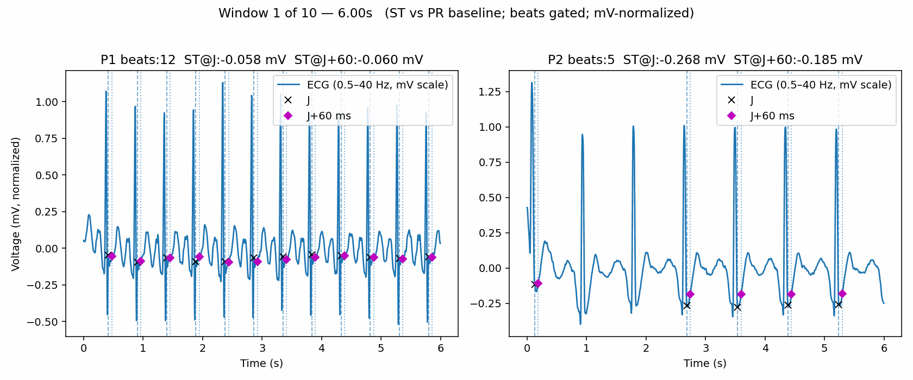

# ECG ST-Segment Analysis and Visualization

Overview  
This project analyzes ECG data to examine ventricular repolarization by measuring ST-segment deviation relative to the PR baseline at the J-point (end of QRS) and at J+60 ms. The pipeline applies a band-pass filter (0.5–40 Hz) to reduce baseline wander and high-frequency noise, detects R-peaks, estimates J, and gates beats so only physiologic detections (plausible J timing with J+60 safely before the next R) are used. Signals are normalized so the median R-peak is approximately 1 mV (heuristic) to make magnitudes easier to interpret when device gain is unknown. The first 10 windows (6 s each, 50% overlap) can be reviewed interactively, and a demo GIF is included. This repository is for exploratory analysis and education and is not a diagnostic tool.

Application  
Typical use is qualitative review of repolarization patterns (for example, stress-test style assessment of ST depression or elevation at J and J+60 ms) and comparison across patients or time windows after consistent filtering and baseline selection.

---

## Visualization

  

---

## Representative window results (mV, normalized)

- Patient 1 — accepted beats: 12  
  ST@J: −0.058 mV  
  ST@J+60: −0.060 mV  
  Interpretation: mild, fairly flat ST depression in this lead.

- Patient 2 — accepted beats: 5  
  ST@J: −0.268 mV  
  ST@J+60: −0.185 mV  
  Interpretation: more pronounced ST depression at J with partial recovery by 60 ms.

---

## Unofficial, non-diagnostic summary

- In this snapshot, Patient 2 shows substantially greater ST depression than Patient 1 (about 3–4× at J).
- J→J+60 trend:
  - Patient 1: ST remains about the same (near-horizontal ST around −0.06 mV).
  - Patient 2: ST moves toward baseline by 60 ms, consistent with upsloping or horizontal depression in this lead.
- These patterns indicate a stronger repolarization abnormality in Patient 2 within the displayed lead and window.

---

## Caveats

- Values are in normalized mV (median R approximately 1 mV); without true calibration, thresholds such as 0.1 mV are approximate.
- Interpretation depends on lead placement, filtering (including the 0.5–40 Hz band-pass), and baseline selection; only a subset of windows/leads is shown.
- Clinical decisions require contiguous leads, consistent changes across time, and clinical context (symptoms, workload).
- This repository is not a medical device and is not intended for diagnosis.